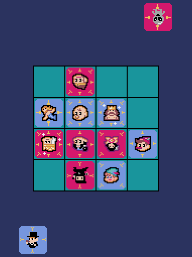

# パネルンド

[トウキョウのハト エサバ・バトル](https://www.youtube.com/watch?v=SsyoqnipHWQ)を参考にしました。
パネルを囲む（サラウンド）ので「パネルンド」です。

## 操作方法

* マウスを使って操作します。
* 「Computer vs Human」を選択するとコンピュータと対戦できます。
  * 「Lv3」が一番強いです。
* 移動したいカードをクリックして、移動先をもう一度クリックします。

## 遊び方

* 自分の番になったら、手札のカードを出すか、場のカードを移動します。
* 手札のカードを出す場合
  * 自分のカードと辺か角で接している場所に出せます。
  * 相手のボスに辺で接している場所には出せません。
  * ４×４より広くなるようには出せません。
* 場のカードを移動する場合
  * カードの矢印のとおりに移動できます。
  * 場のすべてのカードが、辺か角で接する必要があります。
  * ４×４より広くなるようには移動できません。
  * 手札に戻すことができます。その際も、場のすべてのカードが、辺か角で接する必要があります。
* 相手のボスの４辺を、カードか４×４の広さの壁で囲んだら勝ちです。

## プログラム

* ドット絵アイコンは、[ピクセルガロー](https://hpgpixer.jp/)を使用しました。
